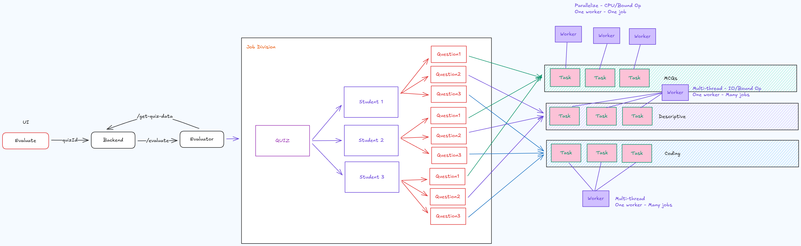
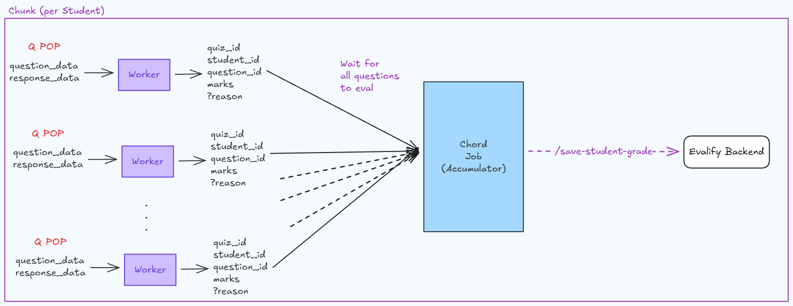

<div align="center">
    
    <br />
    <br />

[](https://github.com/evalify/evalify-evaluator)
[](https://www.python.org/downloads/)
[](https://fastapi.tiangolo.com/)
[](https://docs.celeryq.dev/)
[](https://www.docker.com/)
[](https://github.com/astral-sh/ruff)
[](https://github.com/astral-sh/uv)
[](https://github.com/pre-commit/pre-commit)

</div>

Evalify's Evaluator is a microservice designed to handle the evaluation of student submissions. It is part of the Evalify project, which aims to provide a comprehensive platform for educational assessments.

---

**Note:** ⚠️ This repository is part of an active rewrite of "Evalify" and is being actively developed. The original evaluator ([evalify/DescriptiveEval](https://github.com/evalify/DescriptiveEval)) used `rq` for background jobs and is now outdated — consult it for historical reference only.

## Features

-   **Scalable Architecture**: Designed to handle high-volume evaluation requests asynchronously.
-   **Specialized Workers**: Uses dedicated worker pools for different question types (MCQ, Descriptive, Coding) to optimize resource usage (CPU vs I/O bound).
-   **Factory Pattern**: Easily extensible evaluator system using a factory pattern for registering new question types.
-   **Type Safety**: Fully typed codebase using Pydantic for robust data validation and serialization.
-   **Modern Stack**: Built with FastAPI, Celery, Redis, and managed by `uv`.

## Tech Stack

-   **Language**: Python 3.12+
-   **API Framework**: FastAPI
-   **Task Queue**: Celery
-   **Broker/Backend**: Redis
-   **Package Manager**: uv
-   **Concurrency**: Gevent (for I/O bound tasks) & Prefork (for CPU bound tasks)

## Getting Started

### Prerequisites

-   **Redis**: Required as the message broker and result backend.
-   **uv**: An extremely fast Python package installer and resolver.

### Installation

1.  **Clone the repository:**
    ```bash
    git clone https://github.com/evalify/evalify-evaluator.git
    cd evalify-evaluator
    ```

2.  **Install dependencies:**
    ```bash
    uv sync
    ```

### Configuration

The application is configured using environment variables.

1.  **Set up environment variables:**
    Copy the example configuration file:
    ```bash
    cp .env.example .env
    ```
2.  **Edit `.env`**: Update the file with your specific configuration (Redis URL, API keys, etc.).

### Running the Service (Development)

1.  **Start Redis:**
    ```bash
    redis-server
    ```

2.  **Start the API Server:**
    ```bash
    uv run uvicorn src.evaluator.main:app --reload
    ```
    The API will be available at `http://localhost:8000`.

3.  **Start Workers:**
    You can start all workers (MCQ, Descriptive, Coding) using the provided script (requires tmux):
    ```bash
    ./scripts/start_all_workers_tmux.sh --attach
    ```
    Or start them individually:
    ```bash
    ./scripts/start_mcq_worker.sh
    ./scripts/start_desc_worker.sh
    ./scripts/start_coding_worker.sh
    ```

### Testing

-   **Unit & Integration Tests**: Located in `tests/`. Run them using `pytest`:
    ```bash
    uv run pytest
    ```
-   **Manual/Scripted Tests**: Located in `test_scripts/`. These scripts are useful for manual verification and debugging specific flows.

## Deployment

For production environments, **Docker** is the recommended way to deploy and scale workers.

### Using Docker Compose

You can spin up the entire stack (API, Redis, and Workers) using Docker Compose:

```bash
docker-compose up --build -d
```

This will start:
-   **API Service**: Exposed on port 4040
-   **Redis**: Internal message broker
-   **Workers**: Scalable worker containers for MCQ, Descriptive, and Coding tasks

## Architecture

### Overall Flow
The system handles evaluation requests by dividing them into student-level jobs, which are further broken down into question-level tasks. These tasks are routed to specialized workers based on the question type (MCQ, Descriptive, Coding).



### Job Accumulation
Results from individual question evaluations are accumulated per student. Once all questions for a student are evaluated, the aggregated results are sent back to the main Evalify backend.



## Documentation

Documentation is currently in progress. Some documentation is available in the [`docs/`](docs/) directory. Proper documentation will be written and deployed via [evalify/evalify-docs](https://github.com/evalify/evalify-docs).