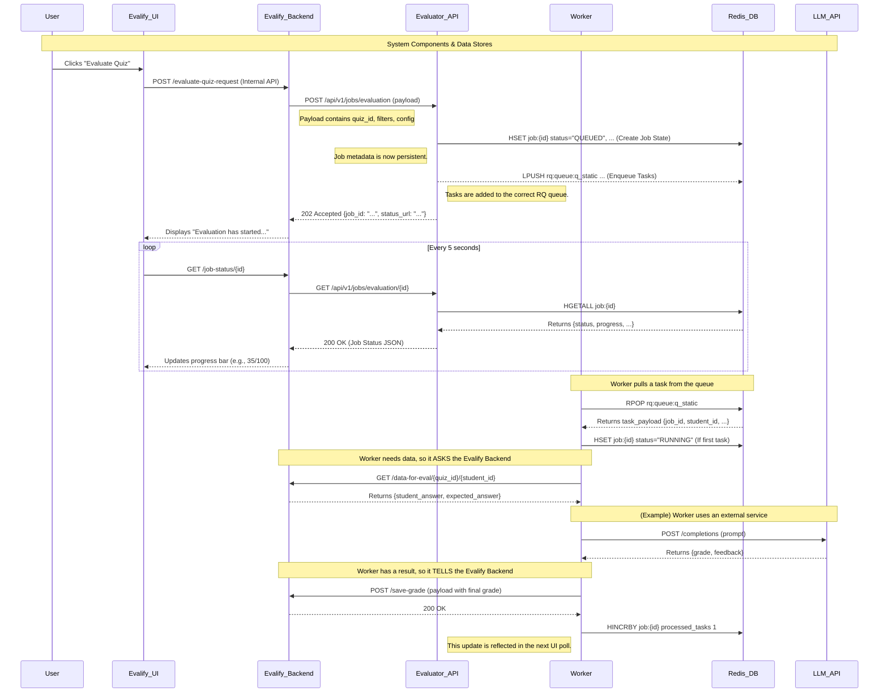

# System Flow Diagram for Evalify-Evaluator

```mermaid
sequenceDiagram
    participant User
    participant Evalify_UI
    participant Evalify_Backend
    participant Evaluator_API
    participant Worker
    participant Redis_DB
    participant LLM_API

    Note over User, LLM_API: System Components & Data Stores
    
    %% Step 1: User initiates the evaluation
    User->>Evalify_UI: Clicks "Evaluate Quiz"
    Evalify_UI->>Evalify_Backend: POST /evaluate-quiz-request (Internal API)
    
    %% Step 2: Evalify Backend creates a job in the Evaluator
    Evalify_Backend->>Evaluator_API: POST /api/v1/jobs/evaluation (payload)
    Note right of Evalify_Backend: Payload contains quiz_id, filters, config
    
    %% Step 3: Evaluator API sets up the job and tasks
    Evaluator_API->>Redis_DB: HSET job:{id} status="QUEUED", ... (Create Job State)
    Note left of Evaluator_API: Job metadata is now persistent.
    Evaluator_API-->>Redis_DB: LPUSH rq:queue:q_static ... (Enqueue Tasks)
    Note right of Evaluator_API: Tasks are added to the correct RQ queue.
    
    Evaluator_API-->>Evalify_Backend: 202 Accepted {job_id: "...", status_url: "..."}
    Evalify_Backend-->>Evalify_UI: Displays "Evaluation has started..."
    
    %% Step 4: UI Polling for Status
    loop Every 5 seconds
        Evalify_UI->>Evalify_Backend: GET /job-status/{id}
        Evalify_Backend->>Evaluator_API: GET /api/v1/jobs/evaluation/{id}
        Evaluator_API->>Redis_DB: HGETALL job:{id}
        Redis_DB-->>Evaluator_API: Returns {status, progress, ...}
        Evaluator_API-->>Evalify_Backend: 200 OK (Job Status JSON)
        Evalify_Backend-->>Evalify_UI: Updates progress bar (e.g., 35/100)
    end
    
    %% Step 5: Worker processes a task
    Note over Worker, Redis_DB: Worker pulls a task from the queue
    Worker->>Redis_DB: RPOP rq:queue:q_static
    Redis_DB-->>Worker: Returns task_payload {job_id, student_id, ...}
    
    %% Step 6: Worker executes the task logic
    Worker->>Redis_DB: HSET job:{id} status="RUNNING" (If first task)
    
    Note over Worker, Evalify_Backend: Worker needs data, so it ASKS the Evalify Backend
    Worker->>Evalify_Backend: GET /data-for-eval/{quiz_id}/{student_id}
    Evalify_Backend-->>Worker: Returns {student_answer, expected_answer}
    
    Note over Worker, LLM_API: (Example) Worker uses an external service
    Worker->>LLM_API: POST /completions (prompt)
    LLM_API-->>Worker: Returns {grade, feedback}
    
    Note over Worker, Evalify_Backend: Worker has a result, so it TELLS the Evalify Backend
    Worker->>Evalify_Backend: POST /save-grade (payload with final grade)
    Evalify_Backend-->>Worker: 200 OK
    
    %% Step 7: Worker updates its own operational state in Redis
    Worker->>Redis_DB: HINCRBY job:{id} processed_tasks 1
    Note left of Worker: This update is reflected in the next UI poll.
```